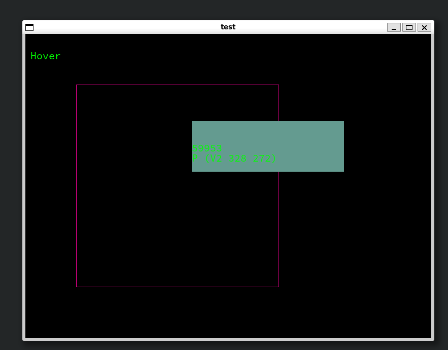

# Example explanation


> There is a box in the picture. When the mouse is outside the box, the status is Idle.
> When the mouse moves inside the box, the status changes to Over.

> When entering the Over state, a timer will be turned on.
>> 1. If the timer times out, enter the Hover state, cancel the timer, and display some information on the upper right corner of the mouse.
>> 2. If the mouse moves out of the box, the status changes to Idle and the timer is cancelled.
>> 3. If the mouse moves within the box, update the timer to prevent entering the Hover state.

> When entering Hover state
>> 1. If the mouse moves within the box, open a new timer and enter the Over state
>> 2. If the mouse moves outside the box, then enter the Idle state

## 1. Define status
```haskell
data Motion
  = Idle
  | Over
  | Hover
  deriving (Show)
```
## 2. Define state transfer messages

```haskell
instance StateTransMsg Motion where
  data Msg Motion from to where
    MoveIn :: Point' -> Timestamp -> Msg Motion Idle Over
    -----------------
    MoveOut :: Msg Motion Over Idle
    InMove :: Point' -> Timestamp -> Msg Motion Over Over
    TimeoutH :: Msg Motion Over Hover
    -----------------
    HInMove :: Point' -> Timestamp -> Msg Motion Hover Over
    HMoveOut :: Msg Motion Hover Idle
```

## 3. Build status processing function

```haskell

timeoutSize :: Int
timeoutSize = 400_000

-- Register timer
myRegisterTimeout :: StateT MotionState IO (TimerManager, TimeoutKey)
myRegisterTimeout = do
  chan <- use channel
  liftIO $ do
    tm <- getSystemTimerManager
    tk <- registerTimeout tm timeoutSize (atomically $ writeTChan chan ())
    pure (tm, tk)
```

```haskell
idelHandler :: Op Motion MotionState Idle Idle  -- Initial state Idle, final state Idle
idelHandler = I.do
  msg <- getInput
  case msg of
    MoveIn pos tms -> I.do                     -- Message generated when the mouse moves inside the box
      At tp <- liftm $ do   
        mousePos .= pos
        (tm, tk) <- myRegisterTimeout          -- Register timer
        pure (tm, tk, tms)
      overHandler tp                           -- Enter overHandler
```

```haskell
overHandler :: (TimerManager, TimeoutKey, Timestamp) -> Op Motion MotionState Idle Over  -- Initial state Over, final state Idle
overHandler (tm, tk, oldtms) = I.do
  msg <- getInput
  case msg of
    MoveOut -> I.do                                -- Message generated when the mouse moves out of the box
      liftm $ liftIO $ unregisterTimeout tm tk     -- Cancel timer
      idelHandler                                  -- Enter idleHandler
    InMove pos tms -> I.do     -- Message generated when the mouse moves inside the box
      liftm $ do
        mousePos .= pos
      if tms - oldtms > 40    -- Compare InMove message timestamps to update the timer less frequently
        then I.do
          liftm $ liftIO $ updateTimeout tm tk timeoutSize   -- Update timer to prevent entering Hover state
          overHandler (tm, tk, tms)               -- Enter the overHandler. It can be seen from the state transition diagram that the InMove message will not change the Over state.
        else overHandler (tm, tk, oldtms)
    TimeoutH -> I.do       -- A message generated when the mouse remains in the box for more than the set 400ms.
      liftm $ do
        liftIO $ unregisterTimeout tm tk   -- Cancel timer
        pos <- use mousePos
        onHover .= Just (pos, [show oldtms, show pos]) 
      hoverHandler   -- Enter hoverHandler
```

```haskell
hoverHandler :: Op Motion MotionState Idle Hover  -- Initial state Hover, final state Idle
hoverHandler = I.do
  msg <- getInput
  case msg of
    HInMove pos tms -> I.do  -- Message generated when the mouse moves in the box
      At tp <- liftm $ do
        mousePos .= pos
        onHover .= Nothing
        (tm, tk) <- myRegisterTimeout  -- Register timer
        pure (tm, tk, tms)
      overHandler tp     -- Enter overHandler
    HMoveOut -> I.do  -- Message generated when the mouse moves out of the box
      liftm $ onHover .= Nothing
      idelHandler    -- Enter idelHandler
```

## 4. Construct functions from events to messages in different states
The event represents an external input event, in this example it represents an sdl Event (wrapped here with MyEvent).

Message represents a state transfer message, in this example:
```haskell
    MoveIn :: Point' -> Timestamp -> Msg Motion Idle Over
    MoveOut :: Msg Motion Over Idle
    InMove :: Point' -> Timestamp -> Msg Motion Over Over
    TimeoutH :: Msg Motion Over Hover
    HInMove :: Point' -> Timestamp -> Msg Motion Hover Over
    HMoveOut :: Msg Motion Hover Idle
```

In different states, there are different mappings of events to messages.
```haskell
data SomeMsg ps from
  = forall (to :: ps).
    (SingI to, Reify to) =>
    SomeMsg (Msg ps from to)

newtype GenMsg ps state event from
  = GenMsg (state -> event -> Maybe (SomeMsg ps from))

-- Indicates how events are converted into messages in different states
-- Ensure that no erroneous messages are generated through dependent-map
type State2GenMsg ps state event = DMap (Sing @ps) (GenMsg ps state event)
```

The functions in this example from events to messages in different states.
```haskell
mouseDepMap :: State2GenMsg Motion MotionState MyEvent
mouseDepMap =
  D.fromList
    [ SIdel
        :=> GenMsg
          ( \(MotionState rect' _ _ _) event -> case event of
              MyMouseMotion (fmap fromIntegral -> p) tms ->
                if rect' `contains` p
                  then Just $ SomeMsg (MoveIn p tms)
                  else Nothing
              _ -> Nothing
          )
    , SOver
        :=> GenMsg
          ( \(MotionState rect' _ _ _) event -> case event of
              MyMouseMotion (fmap fromIntegral -> p) tms ->
                if rect' `contains` p
                  then Just $ SomeMsg (InMove p tms)
                  else Just $ SomeMsg MoveOut
              MyTimeout -> Just $ SomeMsg TimeoutH
          )
    , SHover
        :=> GenMsg
          ( \(MotionState rect' _ (Point mx my) _) event -> case event of
              MyMouseMotion (fmap fromIntegral -> p@(Point x y)) tms ->
                if rect' `contains` p
                  then
                    if abs (mx - x) < 30 && abs (my - y) < 30
                      then Nothing
                      else
                        Just $ SomeMsg (HInMove p tms)
                  else Just $ SomeMsg HMoveOut
              _ -> Nothing
          )
    ]
```


# Run example
cabal run motion
